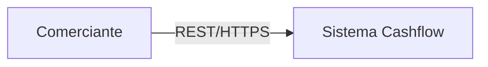
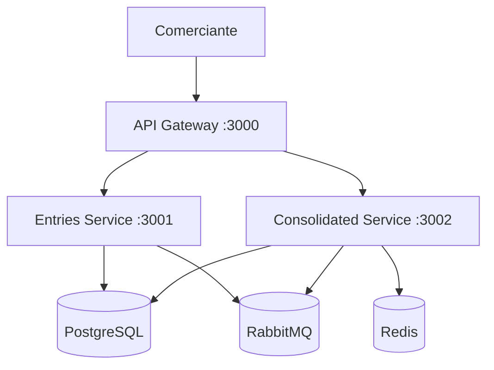
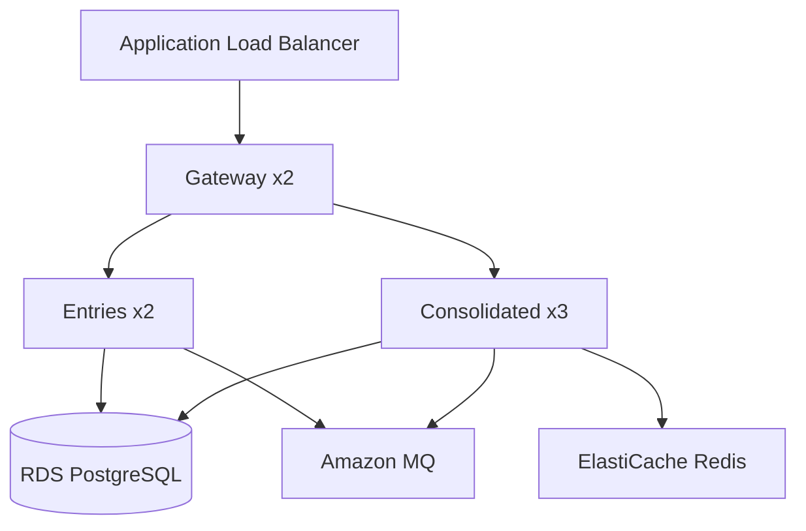

# Arquitetura Alvo (Target Architecture)

## C4 — Nível 1: Contexto



**Sistema Cashflow:** plataforma de controle de fluxo de caixa com lançamentos e consolidado diário.

## C4 — Nível 2: Containers



## Padrões Arquiteturais Aplicados

| Padrão | Aplicação | Justificativa |
|--------|-----------|---------------|
| **Microsserviços** | 2 serviços de domínio + gateway | Isolamento de falha (RNF-01) |
| **CQRS** | Write em ledger; read em reporting | Escala independente do consolidado |
| **Event-Driven** | RabbitMQ + entry.created | Desacoplamento assíncrono |
| **Outbox Pattern** | ledger.outbox_events | Publicação confiável de eventos |
| **Cache-Aside** | Redis no consolidado | 50 req/s com baixa latência |
| **API Gateway** | Auth, routing, rate limit | Segurança centralizada |

## Fluxo de Dados — Criar Lançamento

```mermaid
sequenceDiagram
    participant C as Cliente
    participant GW as API Gateway
    participant ES as Entries Service
    participant DB as PostgreSQL
    participant OB as Outbox Publisher
    participant MQ as RabbitMQ
    participant CS as Consolidated Service
    participant Redis as Redis

    C->>GW: POST /entries (JWT)
    GW->>ES: Forward + x-merchant-id
    ES->>DB: BEGIN; INSERT entry; INSERT outbox; COMMIT
    ES-->>C: 201 Created
    OB->>DB: Poll unpublished outbox
    OB->>MQ: Publish entry.created
    MQ->>CS: Consume
    CS->>DB: Upsert daily_balances
    CS->>Redis: Set cache
```

## Atendimento aos RNFs Críticos

### RNF-01: Lançamentos independente do consolidado

- Write path completo no `entries-service` (DB + outbox)
- Eventos persistidos na fila durável (RabbitMQ)
- Consolidado é consumer opcional; fila acumula eventos se consumer cair
- Gateway `/ready` reporta `degraded` mas mantém entries operacional

### RNF-02: 50 req/s no consolidado, ≤5% perda

- Saldo **pré-computado** no consumer (não calculado em cada GET)
- Cache Redis TTL 30s
- Rate limit gateway: 55 req/s (margem sobre 50)
- Horizontal scaling via múltiplas instâncias + load balancer
- Teste k6 em `tests/load/consolidated-load.js`

## Decisões de Tecnologia

Ver ADRs em [`docs/ADR/`](ADR/).

| Componente | Tecnologia |
|------------|------------|
| Runtime | Node.js 20 + TypeScript |
| Framework | NestJS |
| Banco | PostgreSQL 16 |
| Mensageria | RabbitMQ 3.13 |
| Cache | Redis 7 |
| Métricas | Prometheus (prom-client) |
| Container | Docker Compose |

## Deployment (Produção sugerida)



## Endpoints

| Serviço | Endpoint | Método |
|---------|----------|--------|
| Gateway | `/auth/token` | POST |
| Gateway | `/entries` | GET, POST |
| Gateway | `/entries/:id` | GET |
| Gateway | `/daily-balance` | GET |
| Gateway | `/daily-balance/range` | GET |
| Todos | `/health`, `/ready`, `/metrics` | GET |

## Trade-offs Documentados

| Decisão | Pró | Contra |
|---------|-----|--------|
| Consistência eventual | Alta disponibilidade do write | Saldo pode atrasar segundos |
| Dois schemas PG | Simplicidade operacional inicial | Não isola falha de DB |
| Outbox polling 5s | Simplicidade vs CDC | Latência mínima de projeção ~5s |
| JWT stateless | Escalabilidade gateway | Revogação requer blacklist (futuro) |
