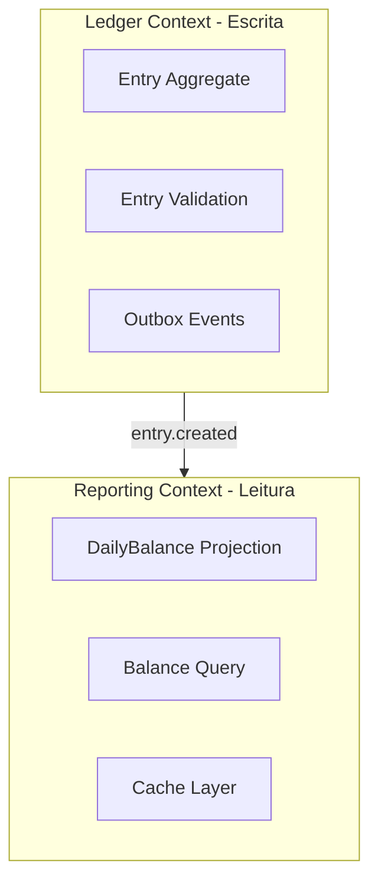
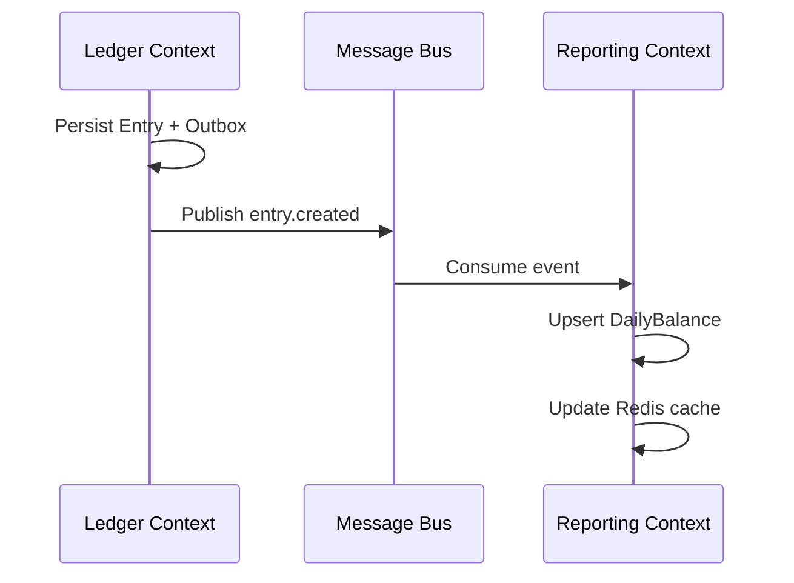

# Domínios Funcionais e Capacidades de Negócio

## Visão de Contextos (Bounded Contexts)

## Domínios Funcionais

### 1. Ledger (Contabilidade Operacional)

**Responsabilidade:** registrar movimentações financeiras do comerciante.

| Entidade | Descrição |
|----------|-----------|
| Entry | Lançamento individual (débito ou crédito) |
| OutboxEvent | Evento pendente de publicação (padrão Outbox) |

**Invariantes:**
- Valor sempre positivo
- Tipo ∈ {DEBIT, CREDIT}
- Lançamento pertence a um merchantId

### 2. Reporting (Consolidação)

**Responsabilidade:** materializar visão de saldo diário para consulta rápida.

| Entidade | Descrição |
|----------|-----------|
| DailyBalance | Projeção agregada por merchantId + date |

**Invariantes:**
- `balance = totalCredits - totalDebits`
- Projeção derivada exclusivamente de eventos (CQRS)

## Capacidades de Negócio

| Capacidade | Domínio | Serviço | Descrição |
|------------|---------|---------|-----------|
| **Controlar fluxo de caixa** | Ledger | entries-service | Registrar e consultar débitos/créditos |
| **Validar lançamento** | Ledger | entries-service | Regras de negócio na criação |
| **Publicar movimentação** | Ledger | entries-service | Outbox + RabbitMQ |
| **Consolidar saldo diário** | Reporting | consolidated-service | Agregar eventos por dia |
| **Consultar posição financeira** | Reporting | consolidated-service | API de leitura otimizada |
| **Autenticar e autorizar** | Platform | api-gateway | JWT, scopes, rate limit |

## Mapa de Integração entre Contextos

## Ubiquitous Language (Linguagem Ubíqua)

| Termo | Definição |
|-------|-----------|
| Lançamento (Entry) | Movimentação financeira unitária |
| Débito (DEBIT) | Saída de caixa |
| Crédito (CREDIT) | Entrada de caixa |
| Saldo (Balance) | Créditos − Débitos no período |
| Consolidado Diário | Agregação de todos os lançamentos de um dia |
| Comerciante (Merchant) | Tenant proprietário dos lançamentos |

## Segregação de Dados

| Schema PostgreSQL | Contexto | Tabelas |
|-------------------|----------|---------|
| `ledger` | Ledger | entries, outbox_events |
| `reporting` | Reporting | daily_balances |

Schemas separados permitem evolução independente e futura extração para bancos distintos.
