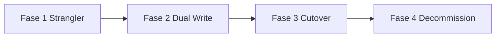

# Arquitetura de Transição

## Cenário Legado

Sistema monolítico existente:
- Tabela única `transactions` (débitos/créditos)
- Relatório de saldo via job SQL batch noturno
- API REST monolítica na porta 8080

## Estado Alvo

Microsserviços CQRS + EDA conforme [`ARCHITECTURE.md`](ARCHITECTURE.md).

## Fases de Migração

### Fase 1 — Strangler Fig (Semanas 1-2)

- Deploy API Gateway na frente do monolito
- Rotas `/entries` (POST) → novo entries-service
- Rotas GET saldo → monolito legado
- Feature flag por merchantId (canary 10%)

### Fase 2 — Sincronização (Semanas 3-4)

- Job CDC (Debezium) ou batch noturno: legado → ledger.entries
- Publicar eventos retroativos para reporting
- Validar paridade: saldo legado vs daily_balances

### Fase 3 — Cutover (Semana 5)

- GET `/daily-balance` → consolidated-service
- Monolito em read-only para transactions
- Monitorar lag de fila e error rate

### Fase 4 — Decommission (Semana 6+)

- Desligar job batch SQL
- Arquivar tabela legado
- Remover rotas strangler

## Rollback

- Gateway reverte rotas via config (Consul/env)
- Fila RabbitMQ retém eventos — sem perda
- Legado permanece read-only como fallback por 30 dias

## Riscos

| Risco | Mitigação |
|-------|-----------|
| Divergência de saldo | Reconciliação diária automatizada |
| Downtime no cutover | Blue/green deploy |
| Perda de eventos | Outbox + fila durável |
